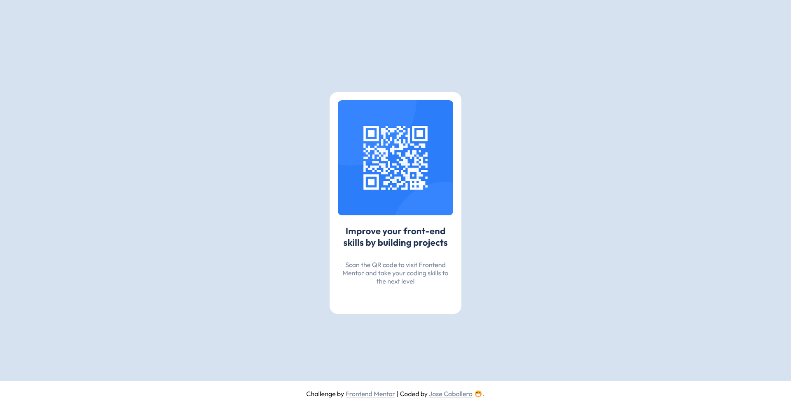

# Frontend Mentor - QR code component solution

This is a solution to the [QR code component challenge on Frontend Mentor](https://www.frontendmentor.io/challenges/qr-code-component-iux_sIO_H). Frontend Mentor challenges help you improve your coding skills by building realistic projects.

## Table of contents

- [Overview](#overview)
  - [Screenshot](#screenshot)
  - [Links](#links)
- [My process](#my-process)
  - [Built with](#built-with)
- [Author](#author)

## Overview

### Screenshot

#### Mobile

#### Desktop

### Links

- Solution URL: [Repository](https://github.com/nonamehz/frontend-mentor-challenges/tree/main/01-QR%20code%20component)
- Live Site URL: [QR Component Challenge - Netlify](https://qrcodecomponent-challenge.netlify.app/)

## My process

### Built with

- Semantic HTML5 markup
- CSS custom properties
- CSS Grid
- Mobile-first workflow

## Author

- Frontend Mentor - [@nonamehz](https://www.frontendmentor.io/profile/nonamehz)
- Twitter - [@joserznc](https://www.twitter.com/joserznc)