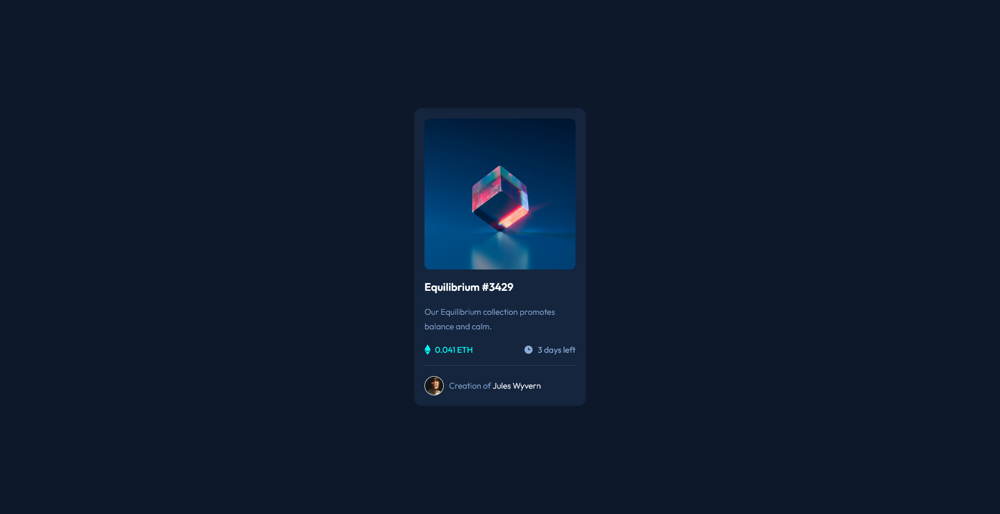
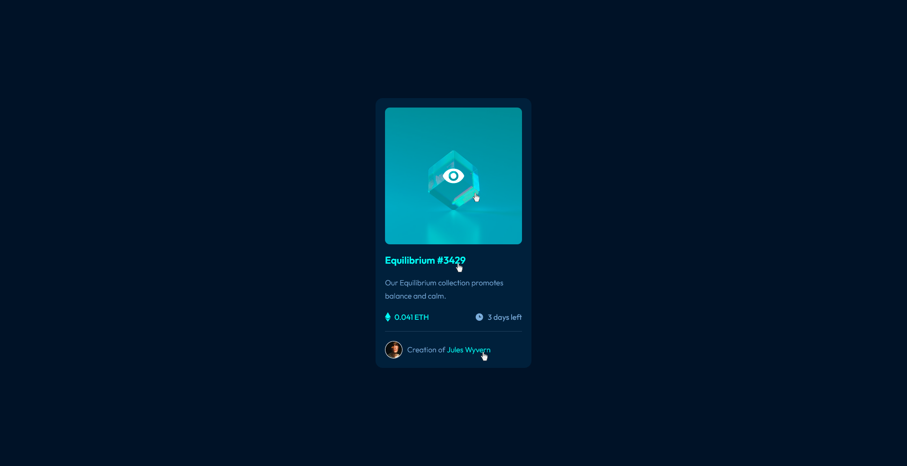

# Frontend Mentor - NFT preview card component solution

This is a solution to the [NFT preview card component challenge on Frontend Mentor](https://www.frontendmentor.io/challenges/nft-preview-card-component-SbdUL_w0U). Frontend Mentor challenges help you improve your coding skills by building realistic projects.

## Table of contents

- [Overview](#overview)
  - [Screenshot](#screenshot)
  - [Links](#links)
- [My process](#my-process)
  - [Built with](#built-with)
- [Author](#author)

## Overview

### Screenshot

#### NFT Preview card component

#### NFT Preview card component - Active states

### Links

- Solution URL: [Repository]()
- Live Site URL: [NFT preview card component Challenge - Netlify]()

## My process

### Built with

- Semantic HTML5 markup
- CSS custom properties
- CSS Grid
- Flexbox
- CSS Animations
- Mobile-first workflow

## Author

- Frontend Mentor - [@nonamehz](https://www.frontendmentor.io/profile/nonamehz)
- Twitter - [@joserznc](https://www.twitter.com/joserznc)