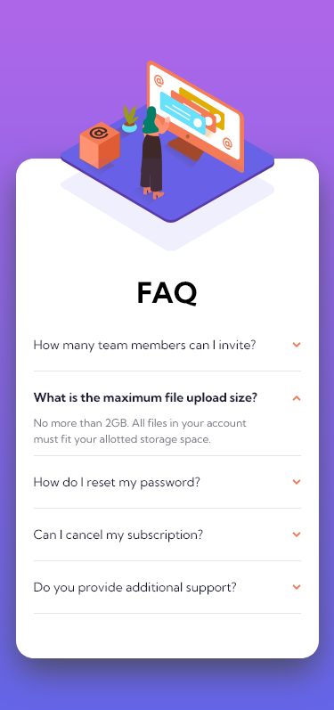
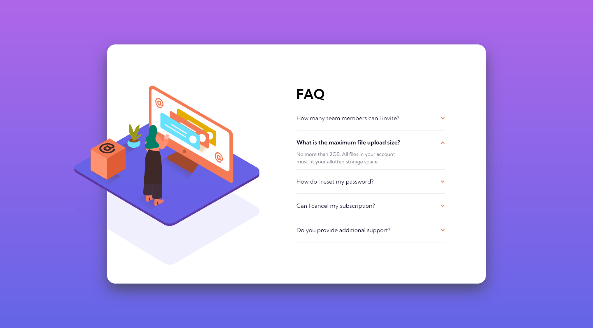
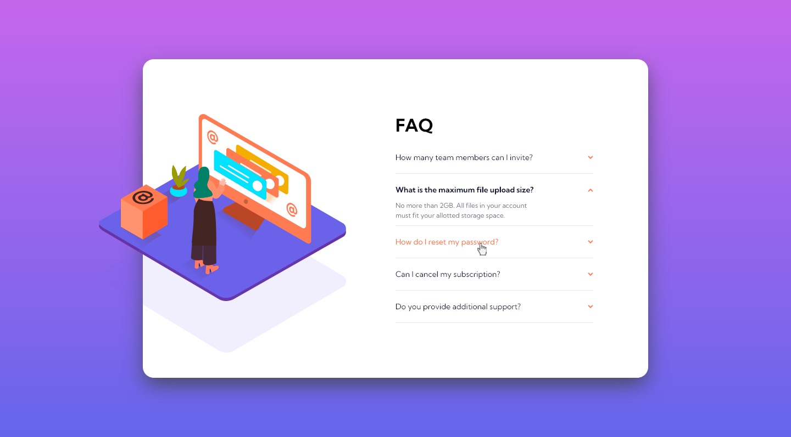

# Frontend Mentor - FAQ accordion card solution

This is a solution to the [FAQ accordion card challenge on Frontend Mentor](https://www.frontendmentor.io/challenges/faq-accordion-card-XlyjD0Oam). Frontend Mentor challenges help you improve your coding skills by building realistic projects.

## Table of contents

- [Overview](#overview)
  - [The challenge](#the-challenge)
  - [Screenshot](#screenshot)
  - [Links](#links)
- [My process](#my-process)
  - [Built with](#built-with)
- [Author](#author)

## Overview

### The challenge

Users should be able to:

- View the optimal layout for the component depending on their device's screen size
- See hover states for all interactive elements on the page
- Hide/Show the answer to a question when the question is clicked

### Screenshot

#### FAQ Accordion Card - Mobile

#### FAQ Accordion Card - Desktop

#### FAQ Accordion Card - Hover States

### Links

- Solution URL: [Repository](https://github.com/nonamehz/frontend-mentor-challenges/tree/main/07-FAQ%20accordion%20card)
- Live Site URL: [FAQ Accordion Card Challenge - Netlify](https://faqaccordioncard-challenge.netlify.app/)

## My process

### Built with

- Semantic HTML5 markup
- CSS custom properties
- Flexbox
- CSS Grid
- Mobile-first workflow
- CSS animations
- Javascript to toggle class

## Author

- Frontend Mentor - [@nonamehz](https://www.frontendmentor.io/profile/nonamehz)
- Twitter - [@joserznc](https://www.twitter.com/joserznc)